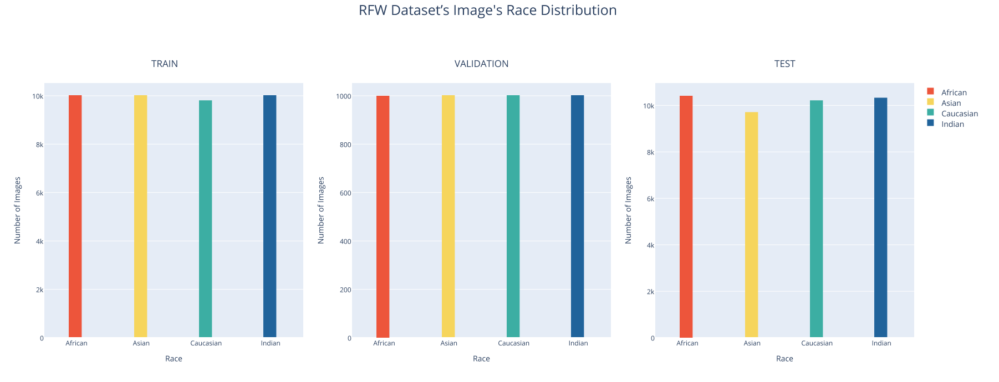
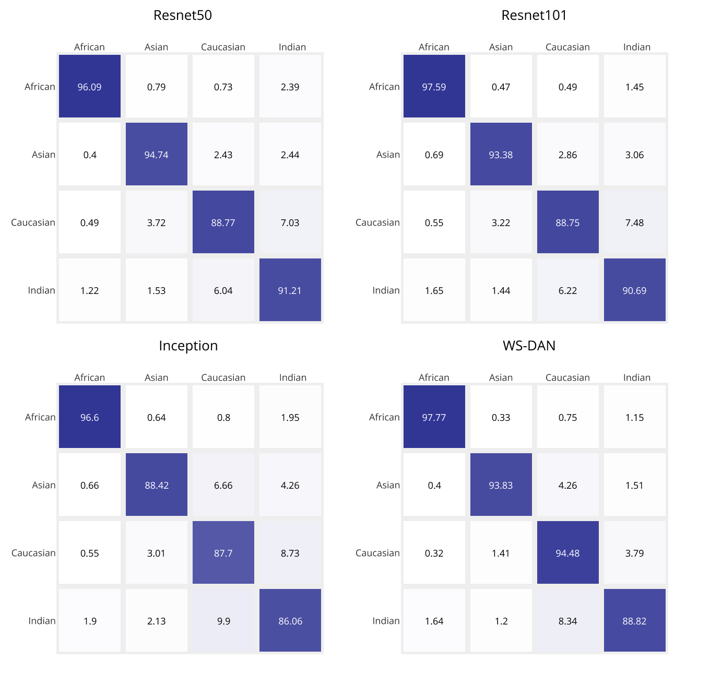

# RaceClassification
This repository does race classification using 4 state-of-the-art models, including Resnet50,Resnet101,InceptionNet and WS-DAN (Fine-Grained Visual Classification). (_Hu et al._, ["See Better Before Looking Closer: Weakly Supervised Data Augmentation Network for Fine-Grained Visual Classification"](https://arxiv.org/abs/1901.09891v2), arXiv:1901.09891)

We encounter 4 races; African,Asian,Caucasian,South Asian (Indian)

## System Requirements

* Pytorch
* Scikit-learn
* Plotly

## Dataset Preparation

We use Racial Faces in the Wild (RFW) dataset for training and test. We subsample the dataset, yielding about 40.000 images for training. Train set is race balance but not gender balance. To download dataset,you should get permission from this [link](http://whdeng.cn/RFW/index.html).
We will share pre-trained models in the models directory.




## Model Train and Test

```cmd
python train_wsdan.py --save-dir models/wsdan/  
python train_sota.py --model resnet100
python train_sota.py --model resnet101
python train_sota.py --model inception
```

```cmd
python test_sota.py --model resnet50 --ckpt models/model.ckpt
python test_sota.py --model resnet101 --ckpt models/model.ckpt
python test_sota.py --model inception --ckpt models/model.ckpt
```
## Results

| Model Name | African | Asian | Caucasian | Indian | Average |
|------------|---------|-------|-----------|--------|---------|
| Resnet50   | 96,09   | 94,74 | 88,77     | 91,21  | 92,7025 |
| Resnet101  | 97,59   | 93,38 | 88,75     | 90,69  | 92,6025 |
| Inception  | 96,06   | 88,42 | 87,07     | 86,06  | 89,4025 |
| WSDAN      | 97,77   | 93,84 | 94,48     | 88,82  | 93,7275 |

### WSDAN Confusion Matrix

